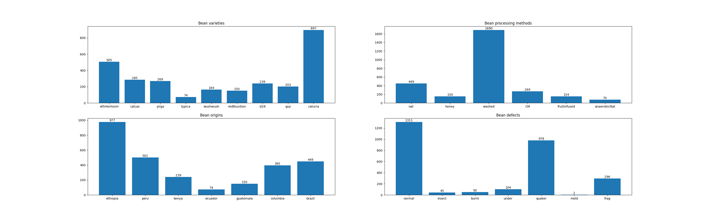

# The images of coffee beans are stored in the `data` directory, with an annotation file provided.

## Defect glossary

| Defect name | Explanation                                                         |
|-------------|---------------------------------------------------------------------|
| frag        | Bean fragment - chipped beans, small pieces                         |
| quaker      | Underdeveloped bean - scorched surface, pale colour, spots          |
| insect      | Insect damage of green bean - small, round holes, damage to surface |
| burnt       | Overroasted bean - much darker colour, shiny, oily surface          |
| mold        | Mold damage to green bean - marks on bean surface                   |
| under       | Underroasted, green bean - much paler, yellow-green colour          |

## Processing method glossary

| Processing method | Explanation                                                                                                           |
|-------------------|-----------------------------------------------------------------------------------------------------------------------|
| nat               | Natural processing - air dried after removing skin from coffee cherry, with coffee cherry flesh remaining on the bean |
| fruitInfused      | Co-fermented with fruit for a specific flavour note, method similar to washed otherwise                               |
| washed            | Beans fermented in water after removing skin from coffee cherry                                                       |
| anaerobicNat      | Natural process, but with no air presence                                                                             |
| honey             | Similar to natural processing, buth with less flesh of the coffee cherry present                                      |
| CM                | Carbonic maceration - beans held in an air free, CO2 rich environment prior to further processing                     |

## Bean classes and counts

### Total count: 2786